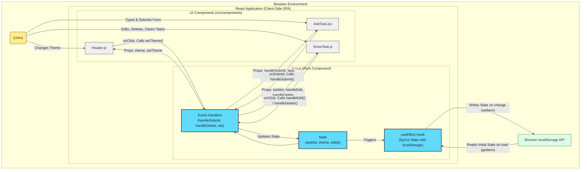

# Architecture Documentation: Taskmate

## 1. Introduction

Taskmate is a client-side single-page application (SPA) built using React. Its primary function is to provide users with a simple interface for managing To-Do tasks (Create, Read, Update, Delete - CRUD operations). It also features theme customization and persists data using the browser's `localStorage`. The architecture focuses on simplicity and leveraging core React features for state management and component structure.

## 2. System Architecture

The application follows a simple client-side architecture pattern:

- **Client-Side Rendering:** The entire UI is rendered and managed within the user's browser using React.
- **No Backend:** There is no server-side component. All data (tasks and theme preference) is stored locally in the browser's `localStorage`.
- **Single Page Application (SPA):** The application loads once, and subsequent interactions dynamically update the UI without requiring full page reloads.

## 3. Folder Structure

The project uses a standard `create-react-app` folder structure:

```
kartikey-taskmate-react/
├── README.md           # Project overview and setup guide
├── package.json        # Project metadata and dependencies
├── public/             # Static assets and HTML template
│   ├── index.html      # Main HTML file template
│   ├── manifest.json   # PWA manifest
│   └── robots.txt      # Instructions for web crawlers
└── src/                # Application source code
    ├── App.css         # Main application styles
    ├── App.js          # Root component, state management, logic orchestration
    ├── index.css       # Global styles and theme definitions
    ├── index.js        # Entry point of the React application
    ├── assets/         # Static assets like images (e.g., logo.svg)
    └── components/     # Reusable UI components
        ├── AddTask.jsx # Component for adding/updating tasks
        ├── Header.js   # Header component with logo and theme selector
        └── ShowTask.js # Component for displaying the task list
```

## 4. Major Components

The application UI is broken down into several key React components:

- **`App.js`**:

  - The root component of the application.
  - Manages the core application state: `tasklist` (array of task objects), `task` (current input value), `editid` (ID of the task being edited), and `theme` (current theme name).
  - Contains the main logic for handling task operations (add, update, delete) via `handleSubmit`, `handleEdit`, `handleDelete`.
  - Manages theme state updates via `setTheme`.
  - Uses `useEffect` hooks to synchronize `tasklist` and `theme` state with `localStorage`.
  - Renders the `Header`, `AddTask`, and `ShowTask` components, passing necessary state and handler functions as props.

- **`Header.js` (in `src/components/`)**:

  - Displays the application title/logo.
  - Contains the theme selection UI (colored circles).
  - Receives the current `theme` and the `setTheme` function as props.
  - Calls `setTheme` when a theme circle is clicked.

- **`AddTask.jsx` (in `src/components/`)**:

  - Renders the input form for adding new tasks or updating existing ones.
  - Receives `handleSubmit`, `editid`, `task`, and `setTask` as props from `App.js`.
  - Displays "Add" or "Update" on the submit button based on the `editid` prop.
  - Updates the `task` state in `App.js` as the user types via the `onChange` handler connected to `setTask`.
  - Calls `handleSubmit` when the form is submitted.

- **`ShowTask.js` (in `src/components/`)**:
  - Displays the list of tasks.
  - Receives `tasklist`, `setTasklist`, `handleEdit`, and `handleDelete` as props from `App.js`.
  - Maps over the `tasklist` array to render each task item.
  - Provides buttons/icons for editing (pencil) and deleting (trash) individual tasks, calling `handleEdit` or `handleDelete` respectively when clicked.
  - Includes a "Clear All" button that calls `setTasklist([])` to empty the task list.
  - Displays the current task count.

## 5. Data Flow

The data flow is unidirectional, typical for React applications using local state management:

1.  **State:** The primary source of truth (`tasklist`, `theme`, etc.) resides in the `App.js` component.
2.  **Props Down:** `App.js` passes state data and callback functions down to child components (`Header`, `AddTask`, `ShowTask`) via props.
    - `Header` receives `theme`, `setTheme`.
    - `AddTask` receives `handleSubmit`, `editid`, `task`, `setTask`.
    - `ShowTask` receives `tasklist`, `setTasklist`, `handleEdit`, `handleDelete`.
3.  **Events Up:** User interactions in child components (e.g., clicking "Add", "Delete", a theme circle) trigger the callback functions passed down as props.
4.  **State Update:** These callback functions execute logic within `App.js` to update the state (e.g., `setTasklist`, `setTheme`).
5.  **Re-render:** React detects the state change in `App.js` and re-renders the necessary components (including children that received updated props), reflecting the changes in the UI.
6.  **Persistence:** The `useEffect` hooks in `App.js` watch for changes in `tasklist` and `theme` state and write the updated values to `localStorage`. On initial load, `useState` reads the initial values from `localStorage`.



## 6. State Management

State management is handled using React's built-in hooks:

- `useState`: Used within `App.js` to manage the list of tasks (`tasklist`), the current value in the input field (`task`), the ID of the task being edited (`editid`), and the selected theme (`theme`).
- `useEffect`: Used within `App.js` to create side effects, specifically:
  - Reading the initial state from `localStorage` when the component mounts (achieved via `useState`'s initial value function).
  - Writing the current `tasklist` and `theme` state to `localStorage` whenever these state variables change.

## 7. Styling

- Global styles and theme definitions are in `src/index.css`.
- Component-specific styles are primarily in `src/App.css`.
- Dynamic styling for themes is achieved by adding a theme class (`light`, `dark`, `gOne`, etc.) to the main `div` in `App.js`. The CSS rules in `index.css` and `App.css` then apply styles based on this parent class.
- Bootstrap Icons are used for icons (edit, delete).

## 8. Persistence

- Data persistence is achieved using the browser's `localStorage` API.
- The `tasklist` array and the `theme` string are serialized to JSON strings before being stored and parsed back when retrieved.
- This ensures data persistence within the same browser even after closing tabs or the browser itself, but it is not suitable for cross-device synchronization or large amounts of data.

## 9. Design Decisions

- **React Hooks (`useState`, `useEffect`):** Chosen for state management and side effects as they are the modern standard in React, promote functional components, and simplify component logic compared to class components for this scale.
- **`localStorage`:** Selected for its simplicity in providing data persistence without requiring any backend infrastructure. Suitable for small-scale, client-only applications. Acknowledges limitations (storage size, sync issues, client-only).
- **Prop Drilling:** State is passed down from `App.js` to child components via props. For this small application, this is sufficient and avoids the complexity of setting up Context API or a state management library like Redux or Zustand. If the application grew significantly, refactoring to use Context API would be considered.
- **Component Structure:** Components are divided based on functionality (`Header`, `AddTask`, `ShowTask`) for better organization and reusability.
